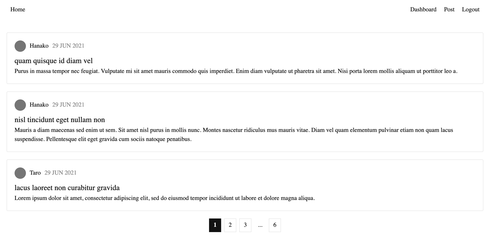

# Hibi - 日々

## About the project

This is a platform for short stories.  
Implemented it using refresh token with JWT authentication in Node.js.

User can login to create, delete and edit their own stories.



### Built With

- Express
- JSON Web Token
- PostgreSQL
- React

## Getting Started

### Prerequisites

Install postgreSQL.

### Installation

1. Clone the repo

```
git clone https://github.com/makokusuda/jwt-authentication.git
```

2. Install NPM packages

```
npm install
```

3. Add `.env` file (Refer to `.env.sample`)
4. Start PostgreSQL and create database `test_db`

```
createdb test_db
```

5. Create data table

```
npm run create
```

6. Run server

```
npm run dev:server
```

7. Run app

```
npm run dev:client
```

8. Visit `http://localhost:8080/#/`
